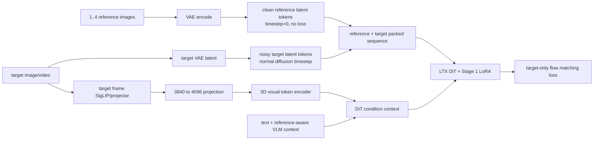
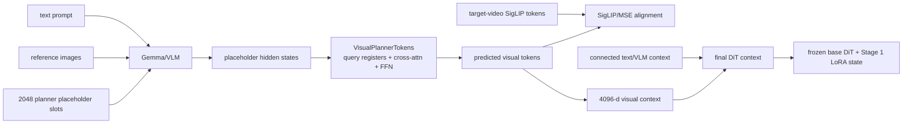

# JD-LTX R2V 相对官方 LTX-2 的完整改动说明

> 本文档说明 `TjieLee/JD-LTX` 在官方 `Lightricks/LTX-2` 基础上，为多参考图像驱动的视频生成（Reference-to-Video，R2V）、I2I/R2V 联合在线训练、Stage 1/2/3 多阶段训练和严格无 GT 推理所做的扩展。

## 1. 对比基线

| 项目 | Commit | 说明 |
| --- | --- | --- |
| 官方上游仓库 | `Lightricks/LTX-2` | 官方 LTX-2 推理、pipeline 和 trainer monorepo |
| JD-LTX 继承的明确上游基线 | `780984275fd47128b02bef9b5c085404276866ee` | 官方 2026-06-17 Public Sync，该 commit 同时存在于官方仓库和 JD-LTX 历史中 |
| JD-LTX 本文档审计 HEAD | `6312b4b404ee9891898dc82ad3ec2b23cb9cb058` | `skip degenerate VLM references during online training` |
| JD-LTX 自基线后的提交数 | 76 | GitHub compare：`7809842...6312b4b` |
| 审计时官方 `main` | `9377758131b1ffde4b7f766804590a6617bf2ab9` | 官方 2026-07-07 Public Sync |

说明：

1. **精确自定义改动范围**按 JD-LTX 自身历史中的公共上游基线 `7809842` 到 HEAD `6312b4b` 计算。
2. 官方仓库在该基线之后仍有更新；本文同时参考审计时官方 `main` 的公开 README 和 trainer 能力说明。
3. 官方 trainer 已支持 T2V、I2V、IC-LoRA、视频/音频 extension、inpainting、outpainting、A2V、V2A 等通用训练能力；JD-LTX 的主要新增不是替换这些功能，而是加入一套**专门的多参考 R2V、VLM Planner 和在线多任务训练体系**。

## 2. 一句话总结

JD-LTX 将官方 LTX-2 的通用 LoRA/全量训练框架扩展成一套三阶段、多参考、视觉规划式 R2V 系统：

1. **Stage 1**：让 DiT 学会读取多张参考图的 clean VAE latent，并使用 target-video 视觉 token 作为 teacher 条件；
2. **Stage 2**：让 Gemma/VLM 根据文本与参考图预测固定 2048 个视觉规划 token，替代推理时不可获得的 target-video GT token；
3. **Stage 3**：联合微调 DiT LoRA、Gemma LoRA、Planner、视觉编码分支和 connector；
4. 增加 **832×480、121 帧、24 fps 的 I2I/R2V 在线训练链路**、确定性 DDP sampler、完整恢复、坏样本同步重试；
5. 增加 **strict-no-GT 原始参考图推理**、checkpoint 完整性审计、外部只读评测和细粒度 guidance 控制。

## 3. 官方能力与 JD-LTX 新增能力对照

| 能力 | 官方 LTX-2 | JD-LTX 扩展 |
| --- | --- | --- |
| T2V / I2V | 支持 | 保留 |
| 通用 reference / IC-LoRA conditioning | 支持 | 保留，不等同于本文专用 R2V 路径 |
| 多张身份/主体参考图直接驱动一个新视频 | 无本文这套专用训练策略 | 新增 `multi_reference_video` |
| clean reference latent 与 noisy target latent 联合 token stream | 无本文实现 | 新增，reference token 位于 target token 前方 |
| 多参考对象分离 | 无本文实现 | 通过负时间 RoPE slot 分离不同 reference entity |
| target-video SigLIP/projector token teacher | 无本文实现 | 新增 Stage 1 teacher 与 Stage 2 alignment target |
| Gemma/VLM 视觉 Planner | 无本文实现 | 新增固定 2048-slot Baton-style Planner |
| Stage 1 / Stage 2 / Stage 3 训练体系 | 无本文实现 | 新增 renderer → planner → joint 三阶段训练 |
| I2I + R2V 同一训练任务 | 官方通用框架不包含本文固定语义 | 新增 1 帧 I2I 与 121 帧 R2V 联合在线训练 |
| 百万级 manifest 流式构建和 offset index | 无本文实现 | 新增 streaming/sharding/resume/index |
| DDP task-synchronized deterministic sampler | 无本文实现 | 新增，所有 rank/accumulation microstep 使用同一 task |
| 在线 VAE/SigLIP/Gemma 编码 | 官方主要训练路径不包含本文链路 | 新增 raw media → strategy batch 在线编码 |
| strict-no-GT R2V replay / external eval | 无本文实现 | 新增，不读取 target latent 和 GT visual token |
| 多方向 guidance | 官方 CFG/STG 基础能力 | 新增 ref、vision、shared-planner guidance 组合 |
| 退化 reference 自动 reject/retry | 无本文专用保护 | 新增 1-pixel geometry、processor error guard |

## 4. 总体架构

### 4.1 Stage 1：多参考 Renderer



关键语义：

- reference latent 是 **clean condition**，不是需要预测的 target；
- reference token 的 timestep 固定为 0，loss mask 为 false；
- target token 使用正常 flow-matching timestep 和 loss；
- 多个 reference 按 `-1, -2, ...` 的负时间 slot 偏移 RoPE，防止多个主体完全重叠；
- reference 与 target 在同一 video self-attention stream 中交互；
- 当前正式 full-token 路径使用 2048 个视觉 token和 `full_tokens_3d_sa` 视觉编码分支。

### 4.2 Stage 2：VLM Planner



Stage 2 的目的不是直接生成视频，而是学习：

> `text + reference images -> target-video visual planning tokens`

推理时没有 target video，因此必须用 Planner 预测 token 替代训练 teacher。

### 4.3 Stage 3：Joint Training

Stage 3 在同一训练图内联合优化：

- Stage 1 DiT LoRA；
- Gemma language-model LoRA；
- Planner query/register/cross-attention/FFN；
- `visual_token_projection`；
- `visual_full_encoder`；
- LTX `video_connector`；
- flow loss、SigLIP alignment loss、NTP loss。

基础 DiT、Gemma backbone、vision tower 和 multimodal projector 保持冻结。

## 5. `ltx-core` 层新增内容

### 5.1 `ltx_core.multicond`

新增目录：

```text
packages/ltx-core/src/ltx_core/multicond/
├── __init__.py
├── cfg_sampler.py
├── factorized_cfg.py
├── planner_tokens.py
├── rope_mask_builder.py
└── visual_tokens.py
```

各文件职责：

#### `cfg_sampler.py`

- 定义 per-sample CFG mode；
- 支持 `full`、`drop_text`、`drop_siglip`、`drop_ref_latents`、`drop_all/null`；
- 在 batch 内保存 mode mask，供 strategy 对不同条件分支分别 dropout；
- 为 factorized inference guidance 提供训练分布基础。

#### `factorized_cfg.py`

- 提供多条件 guidance 的组合辅助；
- 将文本 CFG、reference latent guidance、视觉 Planner guidance 等分量解耦；
- 避免把“无文本”“无 reference latent”“无视觉 token”混成一个无法诊断的单一 negative branch。

#### `rope_mask_builder.py`

- 将多个 reference token 与 target token 打包到同一 video sequence；
- reference timestep 固定为 0；
- reference loss mask 固定为 false；
- target loss mask保持正常；
- 为每张 reference 分配独立负时间 RoPE offset；
- 生成 reference/target token mask 和有效 attention mask。

#### `planner_tokens.py`

- 提供早期/兼容的 Planner token模块；
- 当前主要实现进一步整合在 `visual_tokens.py` 的 `VisualPlannerTokens`。

#### `visual_tokens.py`

这是核心新增模块，包含：

- 从 Gemma/SigLIP vision tower + projector 提取 projected visual token；
- 将视觉 token scatter 回 Gemma image placeholder；
- `3840 -> 4096` trainable projection 支持；
- `Visual3DResampler`：压缩式视觉分支；
- `Visual3DTokenEncoder`：full-token 3D RoPE self-attention visual encoder；
- `VisualPlannerTokens`：固定 slot query、planner hidden K/V、cross-attention、FFN、content residual、slot encoding；
- 视觉 token mask、位置和维度一致性检查。

### 5.2 专用 Gemma system prompt

新增：

```text
packages/ltx-core/src/ltx_core/text_encoders/gemma/encoders/prompts/
├── gemma_multiref_image_edit_planner_system_prompt.txt
└── gemma_multiref_video_planner_system_prompt.txt
```

作用：

- I2I 和 R2V 使用不同任务语义；
- I2I 明确输出单张图像；
- R2V 明确规划目标视频；
- 保持 reference image token、用户 prompt 和 planner slot 的固定序列结构。

### 5.3 官方 Transformer 的改动范围

`packages/ltx-core/src/ltx_core/model/transformer/model.py` 只有很小的兼容性修改；JD-LTX 没有重写官方 48-layer DiT block，也没有自定义新的 STG attention 类型。

R2V 主要通过：

- 新的 strategy；
- 新的 packed latent sequence；
- 新的 condition context；
- 新的 loss 和 guidance；

接入官方 Transformer。

## 6. Trainer strategy 改动

### 6.1 `multi_reference_video.py`

新增文件：

```text
packages/ltx-trainer/src/ltx_trainer/training_strategies/multi_reference_video.py
```

主要改动：

1. 新增 `MultiReferenceVideoConfig`；
2. 新增 `MultiReferenceVideoStrategy`；
3. clean reference latent 与 target latent 打包；
4. target-only flow-matching loss；
5. 多 reference 数量截断与 valid mask；
6. reference 的空间/时间位置缩放；
7. GT visual token 的加载、mask、frame stride 和维度验证；
8. 3840→4096 trainable visual projection；
9. 可选 Q-former 512 token路径；
10. 正式 full-token 2048 + 3D self-attention visual branch；
11. trainable LTX text connector；
12. per-sample factorized CFG dropout；
13. checkpoint-owned strategy module 的保存/加载；
14. 训练 metrics 和 shape diagnostics。

### 6.2 `multi_reference_planner_stage2.py`

新增文件：

```text
packages/ltx-trainer/src/ltx_trainer/training_strategies/multi_reference_planner_stage2.py
```

主要改动：

1. `MultiReferencePlannerStage2Config`；
2. Stage 2 与 Stage 3 两种 training phase；
3. 2048 个固定 Planner placeholder；
4. Gemma online VLM forward；
5. reference image dropout 和 text dropout mask；
6. Planner query registers、slot encoding、3D RoPE；
7. predicted token 与 target-video GT SigLIP token 对齐；
8. `siglip_loss` / `planner_mse_loss`；
9. chunked NTP logits 与 `ntp_loss`；
10. Stage 3 target flow loss；
11. Stage 3 只解冻既有 DiT LoRA，而不解冻 base DiT；
12. Gemma LoRA trainability 与 base Gemma freeze contract；
13. shared Planner inference condition parts；
14. 同一 visual context 复用于 CFG/ref/vision guidance branch；
15. checkpoint state 的严格结构验证。

### 6.3 strategy 注册和基础接口

修改：

```text
packages/ltx-trainer/src/ltx_trainer/training_strategies/__init__.py
packages/ltx-trainer/src/ltx_trainer/training_strategies/base_strategy.py
packages/ltx-trainer/src/ltx_trainer/config.py
```

新增两个 strategy discriminator：

```yaml
training_strategy:
  name: multi_reference_video
```

```yaml
training_strategy:
  name: multi_reference_planner_stage2
  training_phase: stage2 | stage3
```

基础 strategy 接口扩展为可以：

- attach transformer / embeddings processor / text encoder；
- 暴露 strategy-owned trainable modules；
- 保存和加载额外 checkpoint state；
- 输出多项 loss/metrics；
- 区分 Stage 1、Stage 2、Stage 3 的初始化和恢复语义。

## 7. 在线 I2I + R2V 数据链路

新增目录：

```text
packages/ltx-trainer/src/ltx_trainer/online_data/
```

### 7.1 固定训练语义

当前正式 online contract：

| 项目 | I2I | R2V |
| --- | --- | --- |
| target | 单张图像 | 121 帧视频 |
| 分辨率 | 832×480 | 832×480 |
| fps | 1 | 24 |
| VLM/SigLIP 帧 | 1 | `[0,17,34,51,69,86,103,120]` |
| 有效 visual token | 256 | 2048 |
| Planner slot | 2048，前 256 有效 | 2048 全有效 |
| reference 数量 | 1..4 | 1..4 |

### 7.2 Manifest 构建

新增：

```text
online_data/manifest.py
online_data/manifest_schema.py
online_data/manifest_index.py
online_data/parallel_manifest.py
online_data/video_probe_pool.py
```

改进包括：

- JSONL/CSV 流式读取；
- Parquet 使用 PyArrow batch；
- 统一 I2I、OpenS2V R2V schema；
- crop、face_cut、fps、frame count、reference path 验证；
- 确定性 sample key 和 `sample_plan_sha256`；
- 稳定 reject reason；
- 临时 SQLite 去重，避免百万级 Python dict；
- accepted/rejected 临时文件 `flush + fsync + atomic replace`；
- `.idx` byte-offset 索引，dataset 不复制完整 manifest；
- 多进程 shard builder、断点恢复、merge；
- persistent video probe worker pool。

### 7.3 Dataset 与在线编码

新增/扩展：

```text
online_data/multitask_dataset.py
online_data/media_decoder.py
online_data/transforms.py
online_data/online_batch_encoder.py
online_data/visual_token_packing.py
```

功能：

- CPU dataset 只读取 raw media；
- PyAV 精确 frame ordinal 解码和 timeout；
- deterministic resize/center crop；
- VAE reference 与 VLM original reference 分开；
- frozen VAE encoder、SigLIP vision tower、multimodal projector 在线编码；
- Gemma condition 和 Planner input 在线构建；
- I2I/R2V 自动选择 system prompt；
- 输出复用现有 strategy batch keys；
- 在线编码 timing、dtype、device diagnostics。

### 7.4 确定性 DDP sampler

新增：

```text
online_data/distributed_multitask_sampler.py
online_data/data_state.py
```

功能：

- 固定 image/video task ratio；
- 同一 optimizer step 的全部 accumulation microstep 和全部 rank 使用同一 task；
- 每个 rank 获取不同样本；
- task stream、cursor 和 retry stream 可序列化；
- resume 后校验 global step、task cursor 和 manifest-derived indices；
- 避免 resume 后悄悄改变样本序列。

### 7.5 运行时同步重试

Trainer 在线路径新增：

- 任一 rank decode 失败时，所有 rank 在进入 trainable graph 前同步停止该 microbatch；
- 从相同 task 的确定性备用样本 retry；
- retry 不推进正常 task schedule cursor；
- 排除当前 optimizer step 已消费和预取冲突样本；
- `runtime_max_retries` 上限；
- 每 rank JSONL reject log；
- 数据错误与程序错误严格区分。

## 8. 退化 reference 防护

最新提交新增以下保护：

### Dataset guard

拒绝：

- 非 `torch.uint8`；
- 非 `[H,W,3]`；
- `H <= 1`；
- `W <= 1`。

错误包含：

- manifest index；
- sample key；
- task；
- reference index；
- reference path；
- shape；
- dtype；
- reason。

Dataset 将错误转换成 `SampleLoadError`，进入 DDP 同步 retry，而不是让 Gemma processor 的普通 `ValueError` 杀死所有 rank。

### Processor guard

- 对 reference 输入显式传递 `input_data_format="channels_last"`；
- reference processor 的 `ValueError/TypeError` 转成 `OnlineSampleEncodeError`；
- text-only processor 错误仍 fail-fast；
- CUDA/OOM/RuntimeError 不被误吞；
- 错误附带 reference size、mode 和 sample context。

### Read-only audit

新增：

```text
online_data/reference_audit.py
scripts/audit_online_manifest_references.py
```

可以去重扫描 manifest 中所有 reference，报告 missing、decode failure、shape、dtype 和退化 geometry，不修改源图和 manifest。

## 9. 预计算训练链路

JD-LTX 保留官方 `PrecomputedDataset`，并新增 R2V 专用预计算工具：

```text
scripts/precompute_multiref_images.py
scripts/precompute_multiref_vlm_conditions.py
scripts/precompute_gt_siglip_tokens.py
scripts/precompute_planner_vlm_inputs.py
```

目录语义：

```text
.precomputed/
├── latents/                    # target video latent
├── conditions/                 # text-only condition
├── vlm_conditions/             # text + reference images 的 VLM condition
├── multi_reference_latents/    # reference image VAE latent
├── gt_siglip_tokens/           # target-video visual teacher
└── planner_vlm_inputs/         # Gemma input + planner placeholders
```

重要边界：

- `gt_siglip_tokens` 只能来自 target video；
- reference image 不作为 GT visual teacher；
- 推理时不能读取 `gt_siglip_tokens`；
- Stage 2/3 Planner 的存在就是为了在推理时替代 GT teacher。

## 10. Strict-no-GT 推理

新增包：

```text
packages/ltx-trainer/src/ltx_trainer/online_inference/
```

### 10.1 Runtime 与 checkpoint 审计

`checkpoint_runtime.py`：

- 从原训练 config 重建 DiT、Gemma、embeddings processor、strategy；
- 对 checkpoint 做 SHA256、metadata、step 和 training phase 审计；
- 严格验证六类 checkpoint-owned component：
  - DiT LoRA；
  - Gemma LoRA；
  - Planner；
  - visual projection；
  - visual full encoder；
  - video connector；
- 检查 missing、unexpected、duplicate、shape mismatch；
- checkpoint 加载前后 snapshot 一致性检查；
- 支持 ready marker。

### 10.2 Raw condition encoder

`raw_condition_encoder.py`：

- 只接收 reference path、caption 和目标 geometry；
- 不读取 target media；
- 不读取 target latent；
- 不读取 GT SigLIP token；
- reference VAE latent 与 reference VLM image 分开处理；
- 记录 strict-no-GT 证明字段。

### 10.3 单样本 runner

`runner.py`：

- stable seed；
- online Planner condition；
- CFG/ref/vision/STG/guidance-rescale 参数；
- tiled VAE decode；
- 保存 prompt、reference montage、逐张 reference、生成视频、首/中/末帧、contact sheet；
- 保存 checkpoint audit、condition shape、dtype、guidance 和显存 metadata；
- success marker 和原子写入。

### 10.4 Guidance 模式

底层在线推理支持：

```text
synchronized
shared_planner_latent_only
shared_planner_full_vlm_latent_only
```

含义：

- `synchronized`：positive 和 no-ref branch 分别运行 Planner，reference guidance 同时包含 Planner/VLM 和 latent 差异；
- `shared_planner_latent_only`：共享 Planner visual context，positive 使用 text-only prefix，reference guidance 主要比较有/无 reference latent；
- `shared_planner_full_vlm_latent_only`：共享 Planner visual context和 full-VLM prefix，reference guidance 更接近纯 latent 差分。

另外支持：

- standard CFG；
- reference latent guidance；
- vision guidance；
- STG；
- guidance rescale。

注意：审计 HEAD 中，通用训练样本推理入口支持 shared mode；固定 external benchmark CLI 仍限制 `synchronized`，以保证历史 benchmark 设置不被静默改变。若本地 worktree放开 shared external eval，该修改必须单独提交后才属于 GitHub 主分支功能。

## 11. 外部 R2V 评测

新增：

```text
scripts/prepare_external_r2v_eval.py
scripts/infer_external_r2v_eval.py
online_inference/external_eval_schema.py
online_inference/external_eval_runner.py
online_inference/read_only_sources.py
online_inference/media_identity.py
online_inference/output_artifacts.py
```

功能：

- 把 VideoX-Fun、custom64、OpenS2V 等来源规范化成统一 manifest；
- external sample 天然无 target；
- stable-ID seed；
- source JSON/reference file snapshot；
- source path 只读保护；
- 所有 cache、temp 和输出限制到 writable root；
- incomplete output 检测、resume、overwrite-incomplete；
- 每样本独立目录与 flat `Generated_Videos` 导出；
- 自动生成静态 HTML gallery；
- crop-risk 标记；
- incremental run summary；
- 失败样本局部记录，不使整个 benchmark 丢失进度。

## 12. Trainer、checkpoint 和恢复语义

修改：

```text
packages/ltx-trainer/src/ltx_trainer/trainer.py
packages/ltx-trainer/src/ltx_trainer/training_state.py
packages/ltx-trainer/src/ltx_trainer/datasets.py
```

主要改进：

- strategy-owned module 加入 optimizer、DDP prepare 和 checkpoint；
- Gemma LoRA 与 Planner 的联合训练；
- 多 loss 反向传播；
- online dataset 和 online encoder 初始化；
- sampler/data state 保存和恢复；
- Stage 3 strict resume；
- optimizer/scheduler/global step 一致性验证；
- warm-start 与 exact resume 明确区分；
- checkpoint metadata 记录 training phase/global step；
- 成对模型权重和 full training state；
- rank 同步 online retry；
- runtime reject logging。

当前 step 15000 resume guard 配置：

```text
configs/multiref_stage3_resume_step15000_refguard_30k.yaml
```

该配置要求：

- `no_resume: false`；
- full optimizer state；
- full scheduler state；
- data/sampler state；
- 不允许无 optimizer 的 warm resume。

## 13. 新增训练与推理脚本

### 13.1 Manifest / dataset

```text
build_multitask_online_manifest.py
build_multitask_manifest_shards.py
merge_multitask_manifest_shards.py
validate_multitask_online_manifest.py
inspect_multitask_sources.py
convert_phantom_manifest.py
create_overfit_subset.py
check_multiref_precomputed_dataset.py
check_stage2_precomputed_data.py
```

### 13.2 Precompute

```text
precompute_multiref_images.py
precompute_multiref_vlm_conditions.py
precompute_gt_siglip_tokens.py
precompute_planner_vlm_inputs.py
watch_precompute_progress.py
```

### 13.3 Training preflight / smoke

```text
check_stage1_full_tokens_2048_init.py
check_stage2_full_tokens_planner_init.py
check_stage3_joint_init.py
check_multitask_online_training_ready.py
check_multitask_online_real_encode.py
check_multitask_online_stage1.py
check_multitask_online_stage2.py
check_multitask_online_stage3.py
check_multitask_online_ddp.py
run_multitask_online_ddp_smoke_matrix.py
```

### 13.4 Inference

```text
infer_multiref_stage1_overfit.py
infer_multiref_stage2_overfit.py
infer_multitask_online_train_samples.py
select_multitask_online_train_samples.py
prepare_external_r2v_eval.py
infer_external_r2v_eval.py
compare_overfit_generation.py
test_multiref_overfit_generation.py
watch_stage3_checkpoints_and_infer.py
```

## 14. 新增配置

### Stage 1

```text
configs/multiref_stage1_lora.yaml
configs/multiref_stage1_overfit100.yaml
configs/multiref_stage1_visual_branch_2000.yaml
configs/multiref_stage1_full_tokens_2048_2000.yaml
configs/multiref_stage1_multitask_online_480p121_full_tokens_30k.yaml
```

### Stage 2

```text
configs/multiref_stage2_planner.yaml
configs/multiref_stage2_overfit100.yaml
configs/multiref_stage2_full_tokens_planner_2048.yaml
configs/multiref_stage2_full_tokens_planner_2048_ddp_smoke.yaml
configs/multiref_stage2_multitask_online_480p121_full_tokens_planner_30k.yaml
```

### Stage 3

```text
configs/multiref_stage3_joint_full_tokens_planner_2048.yaml
configs/multiref_stage3_joint_full_tokens_planner_2048_ddp_smoke.yaml
configs/multiref_stage3_joint_full_tokens_planner_2048_resume.yaml
configs/multiref_stage3_multitask_online_480p121_joint_30k.yaml
configs/multiref_stage3_multitask_online_480p121_joint_warmstart_benchmark_200.yaml
configs/multiref_stage3_multitask_online_480p121_joint_warmstart_benchmark_200_7gpu.yaml
configs/multiref_stage3_multitask_online_480p121_joint_warmstart_old_stage3_30k.yaml
configs/multiref_stage3_resume_step15000_refguard_30k.yaml
```

### 数据

```text
configs/multitask_online_480p121_data.yaml
```

## 15. 新增测试覆盖

### Multi-reference / Planner

```text
test_multiref_cfg_dropout.py
test_multiref_stage2.py
test_multiref_stage2_inference.py
test_multiref_stage3_joint.py
test_visual_3d_token_encoder.py
test_visual_planner_tokens.py
```

### Online data / DDP

```text
test_multitask_online_480p121.py
test_multitask_manifest_streaming.py
test_online_batch_encoder.py
test_online_encoding_parity.py
test_online_media_decoder.py
test_online_multitask_sampler.py
test_parallel_manifest_builder.py
test_parallel_manifest_merge.py
test_parallel_manifest_resume.py
test_persistent_video_probe_pool.py
test_r2v_builder_performance_semantics.py
test_r2v_prefilter.py
```

### Inference / strict-no-GT / external eval

```text
test_stage1_persistent_inference.py
test_online_raw_inference.py
test_online_inference_checkpoint_and_outputs.py
test_online_train_sample_selection.py
test_external_eval_schema.py
test_external_eval_runner.py
test_external_eval_read_only.py
test_external_eval_output_layout.py
```

### Reference guard

```text
test_online_reference_guard.py
```

覆盖：

- 1×1 / 1×N / N×1 reference；
- channels-last；
- retryable processor error；
- runtime error fail-fast；
- reject log context；
- manifest audit；
- exact resume config。

## 16. 新增文档

```text
docs/multiref_stage1_readme_zh.md
docs/multiref_stage1_readme_en.md
docs/multiref_stage1_stage2_readme_zh.md
docs/multiref_stage1_stage2_readme_en.md
docs/multiref_overfit_test_zh.md
docs/multiref_overfit_test_en.md
docs/multitask_online_480p121_zh.md
docs/multitask_online_480p121_en.md
docs/parallel_manifest_sharded_resume_zh.md
docs/parallel_manifest_sharded_resume_en.md
```

本文档是上述分散文档的上游对比和总览索引。

## 17. 非 R2V 核心改动

从公共基线到当前 HEAD 的 GitHub compare 还包含一些不属于 R2V 核心算法的仓库差异：

```text
.agents/skills/train-model/**
i2v_distilled.py
test_ltx2.py
README.md 的测试性文本修改
models/gemma-3-12b-it-qat-q4_0-unquantized/ 下的仓库元数据/说明文件
```

这些内容不应被描述为 R2V 模型创新。特别是模型权重和大型模型资产不应提交到 Git；当前 compare 中出现的是少量 metadata/README/tokenizer 文件，不代表完整模型被纳入版本控制。

## 18. 当前已知边界

1. **固定 geometry**：正式 online R2V 当前固定 832×480、121 帧、24 fps。
2. **最多四张 reference**：当前 contract 为 1..4。
3. **video-only custom path**：R2V 训练主路径重点优化视频，不是新的同步音视频 R2V trainer。
4. **Planner teacher domain gap**：训练时 target-video GT visual token 是 teacher；推理时 Planner 预测，存在 teacher/prediction gap。
5. **copy-paste / static motion**：属于当前模型和数据分布仍需优化的问题；strict-no-GT 能排除 target 泄漏，但不能自动消除 reference shortcut。
6. **STG 沿用官方机制**：JD-LTX 主要暴露和组合 STG 参数，没有重新训练或重写官方 STG block；不同 scale 会改变动作、ID 和 artifact 的平衡。
7. **external shared guidance**：底层 runtime 已支持 shared mode，但审计 HEAD 的固定 benchmark CLI 仍限制 synchronized。
8. **upstream drift**：JD-LTX 的明确祖先基线是官方 2026-06-17 sync；应定期对照官方新 public sync 处理冲突。
9. **全量 pytest 状态**：历史上存在一个 `test_short_r2v_is_rejected` 的旧 reason 断言与当前实现顺序不一致；这不是 reference-guard 回归，但应单独修正测试语义。

## 19. 最重要的设计改进

从工程和研究角度，最关键的改进不是脚本数量，而是以下五点：

1. **把 reference identity 条件放入 DiT latent stream**，而不仅是文本/图像 embedding；
2. **用 target-video visual token 教会模型“视频应该如何变化”**；
3. **用 VLM Planner 在推理时预测这组视觉变化 token**；
4. **通过 factorized dropout/guidance 分离文本、reference latent 和视觉 Planner 的作用**；
5. **把研究原型扩展成可恢复、可审计、可在百万级数据和多卡环境运行的训练/评测系统**。

## 20. 建议的后续维护

1. 在根 README 增加本文档链接；
2. 把本地放开的 shared external guidance 修改提交到独立 commit，并补 CLI 测试；
3. 修正 `test_short_r2v_is_rejected` 的 reject reason 测试；
4. 为 copy-paste/static motion 建立固定 human-review 和 motion metric 回归集；
5. 增加 foreground-only、background+foreground、portrait、square、wide reference 的分层评测；
6. 定期将官方 `Lightricks/LTX-2/main` 合并到专用 upstream-sync branch，而不是直接覆盖训练分支；
7. 避免在仓库中保存模型资产、运行日志和实验输出。
